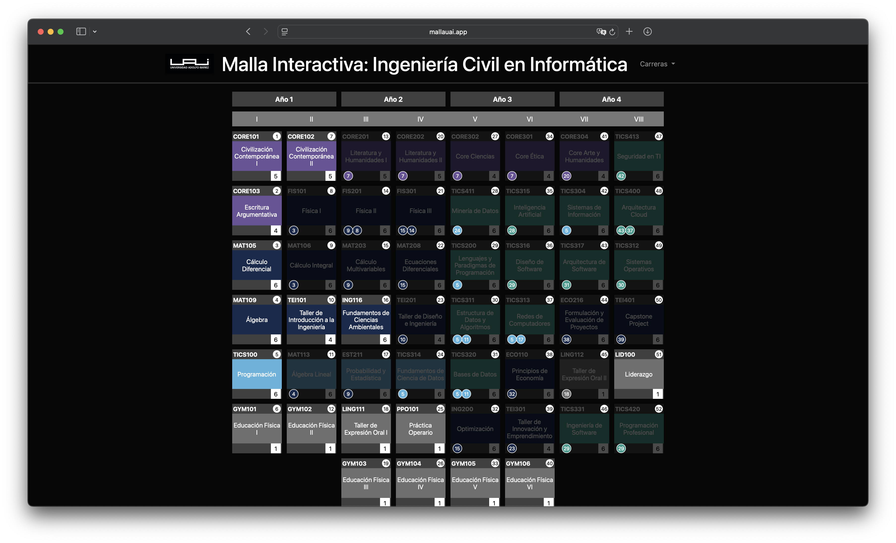

# Malla interactiva UAI
<div align="center">

WebApp para visualizar la malla curricular de tu carrera.

<br>

 




</div>

# Índice
0. [To-Do](#To-Do)
1. [Características de la malla](#Características-de-la-malla)
2. [¿Cómo funciona la malla?](#¿Cómo-funciona-la-malla?)
3. [Probar malla](#Probar-malla)


# To-Do
- [ ] Agregar más carreras
- [ ] Implementar segundo ciclo
  - [ ] Unificar mallas de comercial
  - [ ] poder visualizar licenciatura + 2do ciclo + magister 


# Características de la malla
- Selecciona asignaturas para aprobarlas, a medida que vayas aprobando más ramos, podrás ver qué ramos se desbloquean.
- Guarda tu progreso automáticamente en el navegador.
- Modo oscuro y modo claro automático basado en la configuración del OS.

## ¿Cómo funciona la malla?

Cada malla necesita de un archivo `.json` para que esta se muestre en el sitio. Este tiene por nombre
`data_CARR.json` y se ubica en el directorio `/data`. `CARR` corresponde a la abrebiatura de la carrera (por Ej: ICInf para Ingeniería Civil en Informática).
El archivo contiene la información de cada ramo y sus características agrupados por semestre. Se sigue la siguiente estructura:  
```json5
{
  "s2": [
    ["Cálculo I","MAT101",10,"PC",[]],
    ["Álgebra Lineal","MAT102",10,"PC",[]],
    ...
  ],
//  ...
}
```
En donde  
`s2` Corresponde al semestre, en este caso, Semestre II. `s2` contiene una lista de ramos, donde cada ramo tiene 5 items en el siguiente orden:
1. ***Ramo***: El nombre completo del ramo.
2. ***Sigla***: Sigla del ramo. **Única** para cada ramo, no se puede repetir y no puede contener espacios.
3. ***Créditos SCT***: Entero, la cantidad de créditos SCT (Sistema de Créditos Transferibles).
4. ***Categoría***: Categoría del ramo al que pertenece (por ejemplo, *PC*: Plan Común).
5. ***Prerrequisitos***: Una lista de strings que contiene las siglas de los prerrequisitos del ramo.

Adicionalmente, se debe tener un archivo `colors_CARR.json` que contiene los colores para cada categoría en formato hexadecimal.

## Probar malla 
Primero clonar el repositorio:
```bash
git clone https://github.com/svaldesoliva/malla-interactiva-uai.git
cd malla-interactiva-uai
```
Con *npm* instalado en el equipo, ejecutar en una terminal los siguientes comandos:
```bash
npm install
npm run dev
```
Luego, se debería ejecutar una instancia local de la página en `http://localhost:3000` o en el siguiente puerto disponible. 

---
El [proyecto original](https://github.com/BooterMan98/malla-interactiva) fue creado por alumnos de la Universidad Técnica Federico Santa María.
